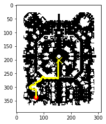

# RO Map Pathfinder

An implementation of the A* algorithm for Ragnarok Online maps

## Demo



## Usage

```py
from mapreader import read_map
from routing import Map

# Read the map file
_grid = read_map('maps/prontera.gat')
_map = Map(grid = _grid)

# Set source and destination
src = (71, 54)
dst = (156, 191)

# Generate path using A* algorithm
route = _map.find_path(src = src, dst = dst)

# Optional : view visualization of the path
_map.show(src = src, dst = dst, path=route)
```

## Author

Kristian Espina